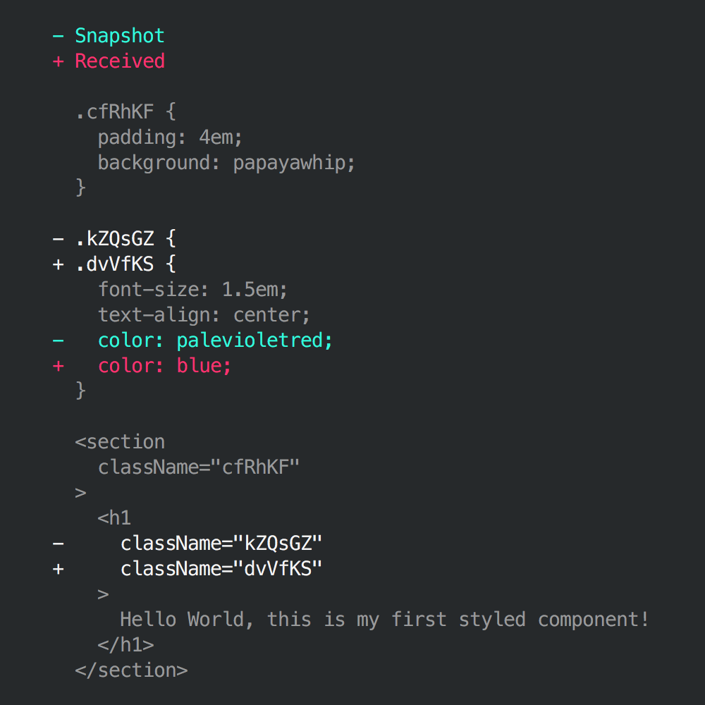
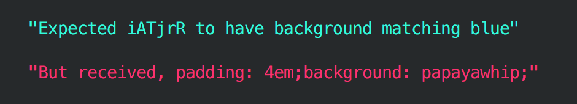
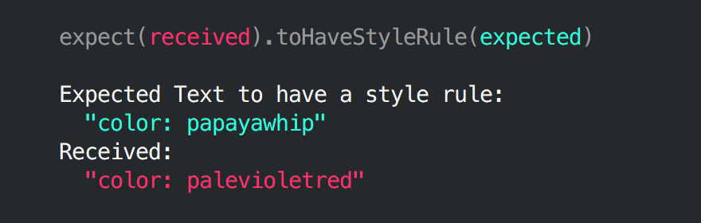
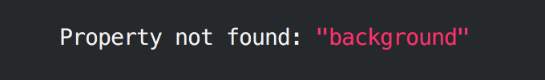

[](https://travis-ci.org/styled-components/jest-styled-components)

# Jest Styled Components
[Jest](https://github.com/facebook/jest) utilities for [Styled Components](https://github.com/styled-components/styled-components).

## Installation

```
yarn add --dev jest-styled-components
```

## toMatchStyledComponentsSnapshot [React]

### Preview



### Usage

```js
// *.spec.js

/**
 * @jest-environment node
 */

import 'jest-styled-components'

// ...

expect(tree).toMatchStyledComponentsSnapshot()
```

## toHaveStyleRule [React]

### Preview



### Usage

```js
// *.spec.js

import 'jest-styled-components'

// ...

expect(tree).toHaveStyleRule('property', value)
```

## toHaveStyleRule [React Native]

### Preview





### Usage

```js
// *.spec.js

import 'jest-styled-components/native'

// ...

expect(tree).toHaveStyleRule('property', value)
```
