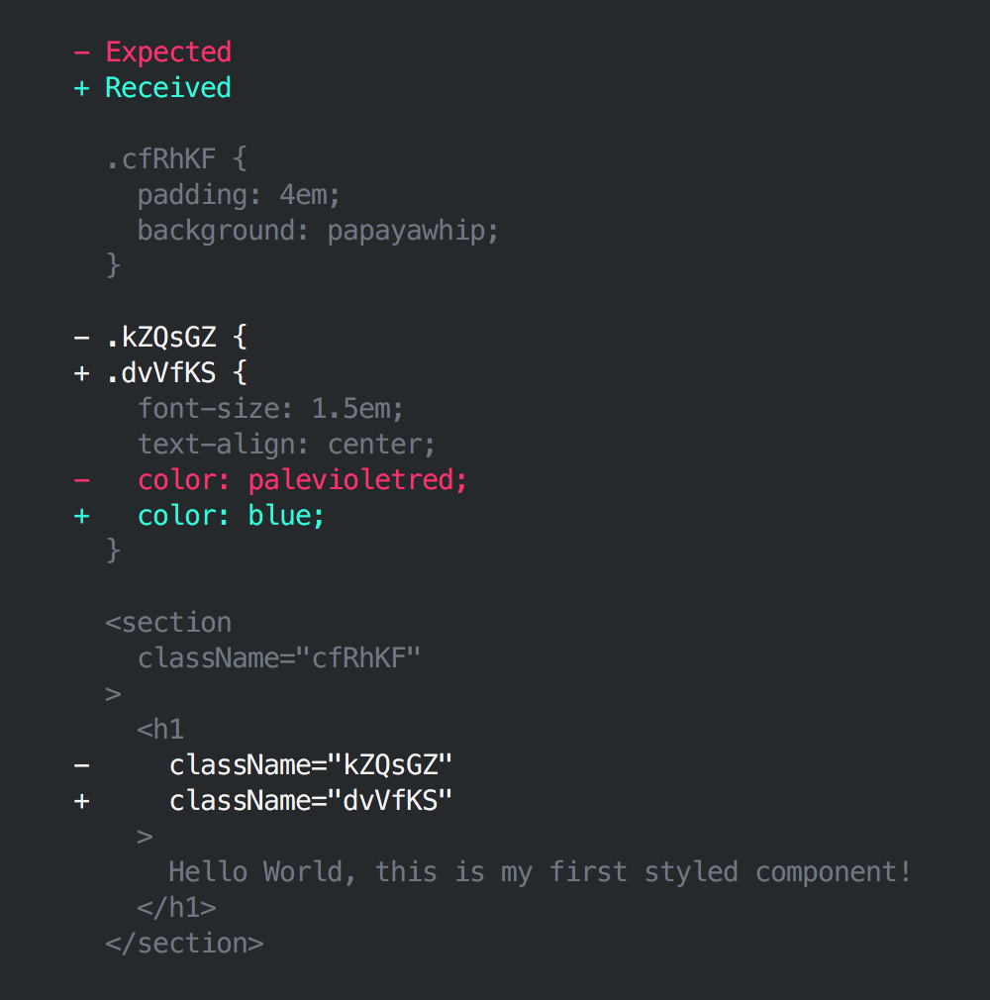

[](https://travis-ci.org/styled-components/jest-styled-components)

# Jest Styled Components
[Jest](https://github.com/facebook/jest) utilities for [Styled Components](https://github.com/styled-components/styled-components).

## Preview



## Installation

```
yarn add --dev jest-styled-components
```

## Usage

```js
// package.json

"jest": {
  "testEnvironment": "node"
}
```

```js
// *.spec.js

import { matcher, serializer } from 'jest-styled-components'

expect.extend(matcher)
expect.addSnapshotSerializer(serializer)

// ...

expect(tree).toMatchStyledComponentsSnapshot()
```
