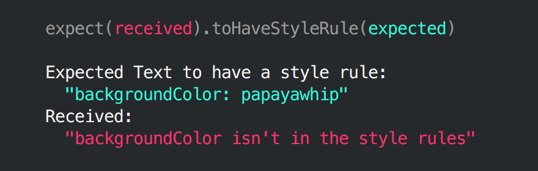

[](https://travis-ci.org/styled-components/jest-styled-components)

# Jest Styled Components
[Jest](https://github.com/facebook/jest) utilities for [Styled Components](https://github.com/styled-components/styled-components).

## Installation

```
yarn add --dev jest-styled-components
```

## React - Snapshot

### Preview


### Usage

```js
// package.json

"jest": {
  "testEnvironment": "node"
}
```

```js
// *.spec.js

import 'jest-styled-components'

// ...

expect(tree).toMatchStyledComponentsSnapshot()
```
## React - Check Style Rule

### Usage
`expect(wrapper).toHaveStyle('css-rule', value)`

Works with [React Test Renderer](https://github.com/facebook/react/tree/master/packages/react-test-renderer) and [Enzyme](https://github.com/airbnb/enzyme)

**React Test Renderer:**
* Needs documentaion.

**Enzyme:**
* Ensure you are using `mount`. It will not work with `shallow`.
* Import `jest-styled-components` at top. Doing so extends `expect` to let you use the `.toHaveStyle()` method.

```js
import React from 'react';
import { mount } from 'enzyme';
import Icon from '../index';
import 'jest-styled-components';

describe('<Icon />', () => {
  it('should pass the color prop to the rendered component', () => {
    const color= '#777';
    const wrapper = mount(
      <Icon
        type="download"
        color={color}
      />);

    expect(wrapper).toHaveStyle('color', color); // passes
  });
});
```

## React Native

### Preview




### Usage

```js
// *.spec.js

import 'jest-styled-components/native'

// ...

expect(tree).toHaveStyleRule('property', value)
```
